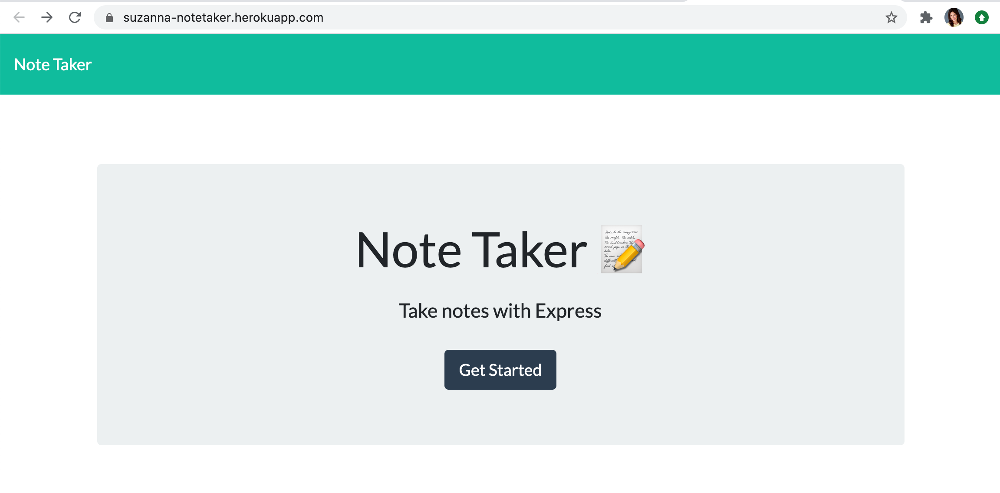

# Notetaker

## Description
This app allows the user to take notes, and saves them to the webpage.  If they no longer need the note, then they can delete it.  I was responsible for the backend.  The HTML, CSS, and frontend Javascript was delivered to me.  I then created get and post requests to handle to data, which I stored in a JSON array. The biggest challenge was getting the notes to delete.  I set up the function to search through the notes' ids, but the function wasn't working. 

## Table of Contents
* [Installation](#installation)
* [Usage](#usage)
* [Contributing](#contributing)
* [Tests](#tests)
* [Questions](#questions)

## Installation
To install necessary dependencies, run the following command:
npm i
npm i express

## Usage
This app is run on the frontend with a UI, so no need to worry about using the repo on the backend, unless you are adding code to it. 
To use the app, please visit [active URL]: https://suzanna-notetaker.herokuapp.com/.  You should be brought to a page that looks like this: 

## Contributing
You will need to install npm, npm express, and run it on port 916. Courtesy of Sacramento's area code. To run it on your computer, use command npm start.

## Tests
To run tests, run the following command: 
npm tests

## Questions
If you have any questions about the repo, please open an issue.
You can find more of my work at github.com/suzannaakins.
